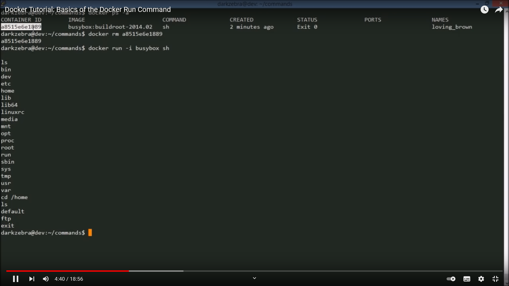

#  My Repo Boilerplate

* [About](#about)
* [Features](#features)
* [Getting Started](#getting-started)
* [Demo](#demo)
* [Troubleshooting](#troubleshooting)
* [Contributing](#contributing)

## About

Praesent malesuada consectetur ipsum, quis elementum magna placerat sed. Quisque consectetur, nulla eget dictum laoreet, orci arcu porttitor ex, vel euismod lorem magna id lorem. Praesent ullamcorper varius nibh. Cras ac scelerisque arcu. Etiam semper scelerisque erat eget placerat. Vestibulum erat eros, maximus non dignissim nec, euismod ut nisi.

## Features

- [x] Curabitur laoreet semper urna, id elementum quam dictum ut
- [x] Vestibulum vitae interdum augue
- [x] Aenean id mauris ut odio ultricies ornare
- [x] Maecenas odio tortor 🔥
- [x] Nam viverra augue vitae tortor imperdiet elementum 🔥

Here are the features we plan to support:

- [ ] Duis facilisis pretium condimentum
- [ ] Cras volutpat condimentum arcu
- [ ] Suspendisse tristique gravida nulla a convallis

## Getting Started

Download the [latest version](https://github.com/GuillaumeExia/repo-boilerplate/releases/latest/download/my-release.zip).

This package includes the build of the application with all spported libraries. The package provides a completely automatic, out-of-the-box experience.

Lorem ipsum dolor sit amet, consectetur adipiscing elit. Quisque tortor est, consectetur a tempor quis, tincidunt vitae sem. Cras sit amet eros vel nulla aliquam interdum. Vestibulum commodo gravida purus. Vestibulum ante ipsum primis in faucibus orci luctus et ultrices posuere cubilia curae; Sed et dictum ipsum.

## Demo

## Troubleshooting

Lorem ipsum dolor sit amet, consectetur adipiscing elit. Curabitur finibus fringilla felis, eget egestas sem semper faucibus. Etiam eget justo at urna sollicitudin rhoncus a ut velit. Maecenas id vestibulum enim. Integer at magna neque. Etiam lectus est, porttitor vel mattis vel, imperdiet in est. Praesent varius molestie eros sed iaculis. Curabitur sagittis urna sit amet tincidunt feugiat. In sollicitudin orci dui. 

## Contributing

Lorem ipsum dolor sit amet, consectetur adipiscing elit. Integer iaculis felis ex, sagittis consectetur lorem tincidunt ac. Duis sodales turpis quis purus condimentum, sed sagittis tellus lobortis. Morbi sit amet bibendum nunc. Aenean interdum imperdiet neque. Aliquam blandit aliquet leo in fringilla. Nullam in dignissim lorem. Nam hendrerit velit nec nisl sagittis convallis. Sed egestas augue ut cursus maximus. Nunc metus lectus, elementum at fermentum a, mollis eget erat.
